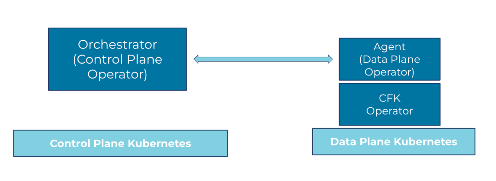
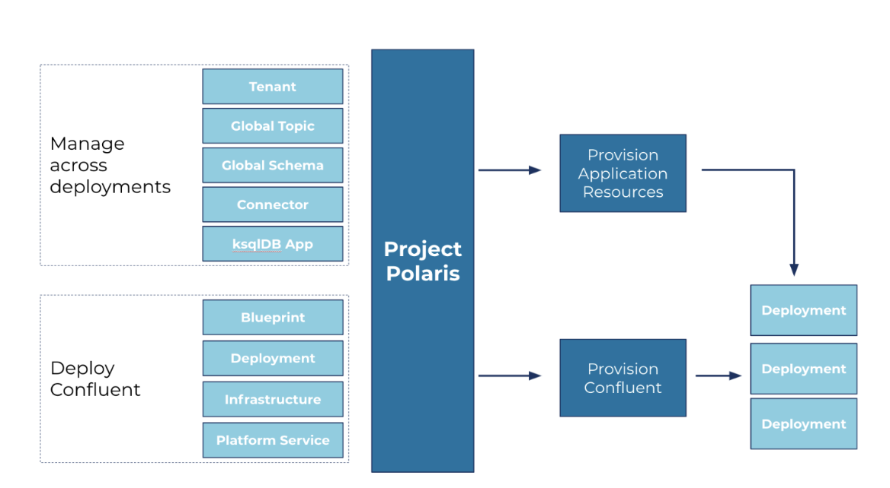

========================
Project Polaris Overview
========================

*Note*: Polaris is an internal project name for the blueprint-based deployments of
Confluent for Kubernetes. 
   
Overview
--------

Polaris is an API-based, cloud-native tool for standardizing Confluent
deployments. It provides a self-service capability to install Confluent Platform
components and manage their application resources. Polaris enables your
organization to manage its Confluent clusters with consistency across the hybrid
clouds. It provides a single pane of glass for:

* Managing multiple Confluent Platform clusters
* Deploying and distributing applications at scale
* Auditing and compliance

Polaris facilitates different teams in your organization to install and manage
CFK, for example, the platform team creates CFK blueprints to enforce
infrastructure and deployment standards, and the application teams take the
blueprints for standard deployments or further customize the blueprints to shape
the deployments to their needs.

High-level architecture
------------------------

Polaris provides Kubernetes CustomResourceDefinition (CRDs) for all aspects of
configuring, deploying, and managing Confluent on Kubernetes.

Components 
----------

Orchestrator on Control Plane
  * A set of controllers that service the Kubernetes APIs 
  * Generates and co-ordinates Layer-1 CFK APIs to deploy Confluent Platform
  * Manages status of Polaris components
  * Supports dynamic registration of Data Plane clusters.
  * Provides unified orchestration for Confluent Platforms on multiple cluster regions.

Kubernetes Cluster
  * Orchestrator uses the information in this CR to propagate CFK APIs to the right K8s cluster.
  * An immutable representation of a data plane Kubernetes cluster. 
  * Contains Information about regions and zones of a data plane cluster.

Health Check
  * Periodically probe all registered Agents’ heartbeats to check the availability of the Polaris services.
  * CPC Orchestrator uses this resource to allow or deny user requests based on the availability of services. 

Blueprint
  * Standardizes how Confluent should be deployed across the organization, including credentials, certificates, RBAC, licensing, and which Confluent components to be deployed.
  * Blueprint references Confluent component classes CRs that represent corresponding CP components.

Cluster Class
  * Part of the Polaris Blueprint.
  * Provides a way for platform administrators to describe the classes of different Confluent deployments which helps to standardize Confluent deployments.
  * Contains the information, such as:
  
    * Provisioner types: CFK or Confluent Cloud
    * Min and max replicas
    * Min and max volume capacity
    * Confluent configurations, such as config overrides, images, etc.

Agent on Data Plane
  * Pulls the needed resources from the Control Plane to the Data Plane to run CFK.
  * Orchestrator Health Check probes Agents for healthy heartbeats.

Workflow
--------

A typical workflow described in this section employs two team personas:

* Platform Team installs and manages: K8S cluster CR, Blueprint CR, CP cluster class CR

* Application Dev Team installs and manages: CP cluster CRs

Day 0
  * The Platform Team sets up the CPC Control Plane infrastructure.
  
  * The Platform Team registers the target Data Plane Kubernetes infrastructure.
  
  * The Platform team defines Blueprints.

Day 1
  * Either the Application Dev Team or the Platform Team selects a Blueprint for a CP deployment.
  
  * The Platform Team administers deployment provisioning.

Day 2
  * The Application Dev Team creates application resources for a provisioned CP deployment.

  * The Application Dev Team creates “global” application resources across multiple provisioned deployments.
