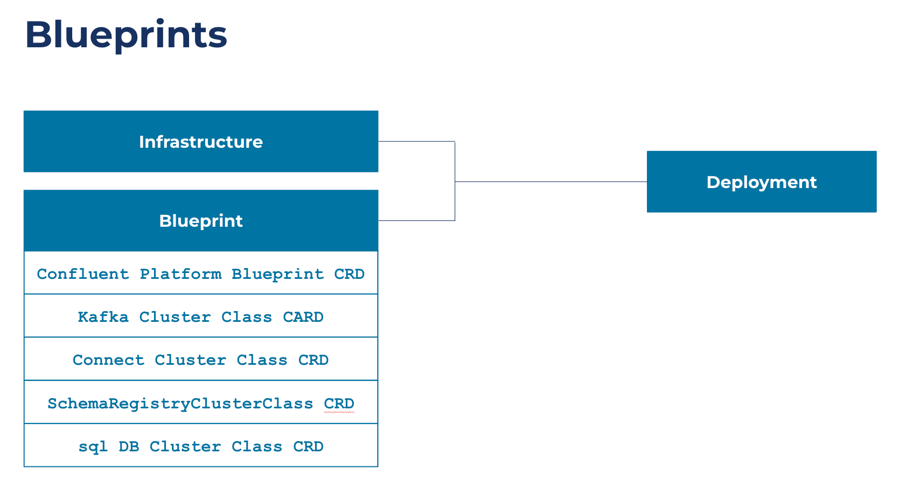
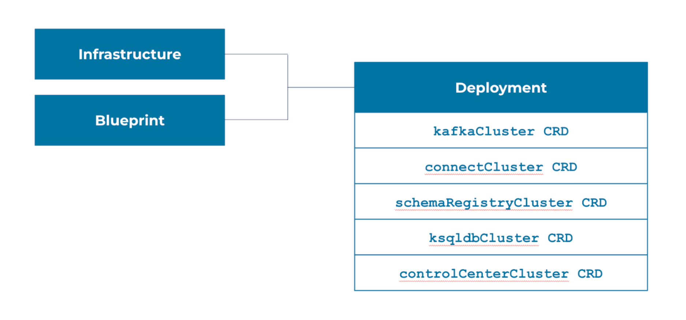
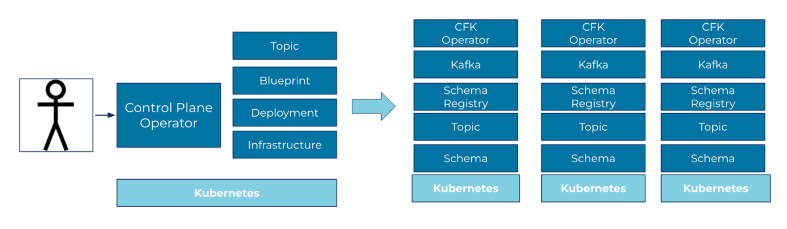

============================================
Confluent for Kubernetes Blueprints 
============================================

Overview
--------

Confluent for Kubernetes (CFK) Blueprints extend CFK with a new set of
Kubernetes-native APIs (CustomResourceDefinitions) that configure, deploy and
operate Confluent Platform services and application resources.

Blueprints enable you to define a standardized Confluent deployment by
providing a single API for teams to create and manage those deployments.

Blueprints enable the Platform teams to provide a self-service API to their
application teams. Platform teams define a set of Blueprints for Confluent, and
then the application teams use a simplified API to create deployments from a
Blueprint.

You can use Blueprints to manage deployments in a single Kubernetes cluster or
across multiple Kubernetes clusters.

Conceptual architecture
------------------------

A Blueprint is a set of CustomResourceDefinitions (CRDs) that define the
configuration and shape of how Confluent should be deployed. The Confluent
Platform Blueprint configures component wide properties, such as security
(authentication, authorization, encryption), networking, container registry,
etc.

A Deployment is an instantiation of a Blueprint on a target Kubernetes
infrastructure.

There are two types of infrastructure configurations options to use CFK
Blueprints with:

* Single Kubernetes cluster where Blueprint & Deployments are defined and
  Confluent Platform is deployed, all on the same Kubernetes cluster.

* Multiple Kubernetes clusters, with one Control Plane and many Data Plane
  Kubernetes clusters. 
  
  * Blueprints and Deployments are defined on the Control Plane Kubernetes.
  
  * Confluent Platform is deployed on the Data Plane Kubernetes.

In a multi-Kubernetes configuration:

* The Control Plane has the Control Plane Orchestrator deployed. 

  The Control Plane Orchestrator probes Agents for healthy heartbeats.

* Each Data Plane has an Agent deployed. 

  The Data Plane Agent pulls the needed resources from the Control Plane to the
  Data Plane to run a Confluent Platform deployment. 
  

.. image:: concepts/images/tech-overview-1.png
   :scale: 75%

Workflow
--------

A typical workflow described in this section employs two team personas:

* The Platform Team installs and manages: Kubernetes cluster CR, Blueprint CR, 
  Confluent Platform cluster class CR

* The Application Dev Team installs and manages: Confluent Platform cluster CRs

Day 0
  * The Platform Team sets up the Control Plane infrastructure.
  
  * The Platform Team registers the target Data Plane Kubernetes infrastructure.
  
  * The Platform Team defines Blueprints.

Day 1
  * Either the Application Dev Team or the Platform Team selects a Blueprint for 
    a Confluent Platform deployment.
  
  * Either the Application Dev Team or the Platform Team administers deployment 
    provisioning.

Day 2
  * The Application Dev Team creates application resources for a provisioned 
    Confluent Platform deployment.

  * The Application Dev Team creates “global” application resources across 
    multiple provisioned deployments.

Components 
----------

Orchestrator on Control Plane
  * A set of controllers that service the Kubernetes APIs 
  * Generates and coordinates Layer-1 CFK APIs to deploy Confluent Platform
  * Manages status of Blueprints components
  * Supports dynamic registration of Data Plane clusters.
  * Provides unified orchestration for Confluent Platforms on multiple cluster regions.

Kubernetes Cluster
  * Orchestrator uses the information in this custom resource (CR) to propagate 
    CFK APIs to the right Kubernetes cluster.
  * An immutable representation of a Data Plane Kubernetes cluster. 
  * Contains Information about regions and zones of a Data Plane cluster.

Health Check
  * Periodically probe all registered Agents’ heartbeats to check the availability of the Blueprint services.
  * CPC Orchestrator uses this resource to allow or deny user requests based on the availability of services. 

Blueprint
  * Standardizes how Confluent should be deployed across the organization, including credentials, certificates, RBAC, licensing, and which Confluent components to be deployed.
  * Blueprint references Confluent component classes CRs that represent corresponding CP components.

Cluster Class
  * Part of the CFK Blueprint.
  * Provides a way for platform administrators to describe the classes of different Confluent deployments which helps to standardize Confluent deployments.
  * Contains the information, such as:
  
    * Provisioner types: CFK or Confluent Cloud
    * Min and max replicas
    * Min and max volume capacity
    * Confluent configurations, such as config overrides, images, etc.

Agent on Data Plane
  * Pulls the needed resources from the Control Plane to the Data Plane to run CFK.
  * Orchestrator Health Check probes Agents for healthy heartbeats.

