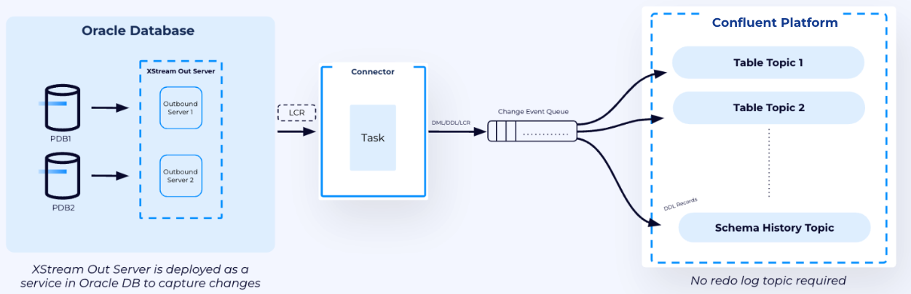

# Oracle XStream CDC Source Connector with Oracle 21c Enterprise Edition

In this workflow, we will set up, configure, and validate the Oracle XStream CDC Source Connector with Oracle Database 21c Enterprise Edition and the Confluent Platform.

- Provision Oracle Database 21c Enterprise Edition using Oracle Operator for Kubernetes (OraOperator)

- Prepare and configure Oracle XStream on Oracle Database 21c Enterprise Edition

- Deploy Confluent Platform using CFK operator and deploy Oracle XStream CDC Source Connector

- Validate and test the Oracle XStream CDC Source Connector with enterprise-grade Oracle database

## 🖼️ Architecture Overview

<p align="left" width="60%">
    
</p>

---

## 📋 Prerequisites

  - Requires Kubernetes cluster

    - Access and set KubeContext to the target Kubernetes cluster

    - Default Storage Class configured

    - Worker nodes with sufficient resources

  - `git, kubectl, helm, jq` commands exist

    ```sh
     command -v git kubectl helm jq
    ```

  - Git clone the repository
 
    ```sh
    git clone https://github.com/confluentinc/confluent-kubernetes-examples.git

    # Change to the 21c-ee Oracle XStream CDC Source Connector example directory
    cd connector/oracle-xstream-cdc-source/21c-ee
    ```

  - Set environment variables

    ```sh
    {
      export CP_HOME=$(pwd)
      export CP_NS='confluent'
      export ORACLE_HOME=$(pwd)/oracle
      export ORACLE_NS='oracle'
      echo "CP_HOME=${CP_HOME} \nCP_NS=${CP_NS} \nORACLE_HOME=${ORACLE_HOME} \nORACLE_NS=${ORACLE_NS}"
    }
    ```

---

## 🗄️ Provision and Configure Oracle Database with XStream Out Interface

Follow the steps in [Provision and Configure Oracle Database with XStream Out Interface](./oracle/database.md) to provision the Oracle Database and complete the database pre-requisites required for Oracle XStream CDC Source Connector.

> **Note:**  
> Oracle Database prerequisites must be **completed and validated** before the XStream CDC Source Connector will function as expected in Confluent Platform.

---

## 🚀 Deploy Confluent Platform using CFK Operator

### Deploy Confluent for Kubernetes Operator

  ```sh
  {
    helm repo add confluentinc https://packages.confluent.io/helm
    helm repo update confluentinc
    # 3.0.0 - 0.1263.8
    helm upgrade --install confluent-operator \
      confluentinc/confluent-for-kubernetes \
      --set kRaftEnabled=true \
      --version 0.1263.8 \
      --namespace ${CP_NS} \
      --create-namespace
    kubectl config set-context --current --namespace=${CP_NS}
    helm ls
    kubectl wait pod -l app.kubernetes.io/name=confluent-operator --for=condition=ready --timeout=180s
  }
  ```

### Deploy Confluent Platform

```sh
{
  kubectl apply -f ${CP_HOME}/confluent-platform.yaml \
                -f ${CP_HOME}/configmap-oracle-xstream-pod-overlay.yaml
  echo "\n *** Waiting for all pods to be ready ***"
  kubectl wait pod --all --for=condition=ready --timeout=360s
  kubectl get pods
}
```

> **Note:**  
> While the recommended approach is to build a custom Connect image with the Oracle XStream CDC Source Connector plugin and dependencies, this example uses an pod overlay/Init Container feature to install the plugin, Oracle Instant Client and required libraries. Following tasks are performed by the Init Container, configured in the [configmap-oracle-xstream-pod-overlay.yaml](./configmap-oracle-xstream-pod-overlay.yaml):
> 
> - Download and extract Oracle Instant Client
> - Download and extract Oracle XStream CDC Source Connector
> - Setup libaio
> - Copy Oracle JARs to plugin
> - Configure LD_LIBRARY_PATH 
>
> To check the logs of this Init Container, open a new terminal and run the following command:
> ```sh
> kubectl logs -f connect-0 -c oracle-xstream-cdc-installer
> ```

## 🔗 Deploy Oracle XStream CDC Source Connector

Once all prerequisites the Oracle Database and Confluent Platform are deployed and ready, we can deploy the Oracle XStream CDC Source Connector by using a Connector custom resource [connector-oracle-xstream-cdc.yaml](./connector-oracle-xstream-cdc.yaml).

### Deploy Oracle XStream CDC Source Connector

```sh
{
  kubectl apply -f connector-oracle-xstream-cdc.yaml
  kubectl get connector oracle-xstream-cdc-source
  echo "Waiting for the Oracle XStream CDC Source Connector to be ready..."
  kubectl wait connector oracle-xstream-cdc-source --for=jsonpath='{.status.connectorState}'=RUNNING --timeout=180s
  kubectl get connector oracle-xstream-cdc-source
}
```
Connector should has status `CREATED`, connector status `RUNNING` and tasks ready `1/1`.

### Validate Oracle XStream CDC Source Connector

Open a new terminal and port-forward the Control Center service.

```sh
{
  export CP_NS='confluent'
  kubectl port-forward svc/controlcenter 9021:9021 -n ${CP_NS}
}
```

Open the browser and navigate to http://localhost:9021.

Click on **controlcenter.cluster** cluster and click on **Topics** tab on the left sidebar, we should see the following topics related to the Oracle XStream CDC Source Connector:

- `ORCLPDB1.SAMPLE.EMPLOYEES` - CDC data topic
- `__orclpdb1-schema-changes.cflt` - Schema change events topic

Select the `ORCLPDB1.SAMPLE.EMPLOYEES` topic and click on **Messages** tab to see the initial records.

### Test CDC Functionality

**Insert Test Data:**

```sh
{
  kubectl exec -it oracle-db-0 -n oracle -- sqlplus sample/password@ORCLPDB1 <<EOF
ALTER SESSION SET CURRENT_SCHEMA = SAMPLE;
INSERT INTO employees VALUES (2001, 'Neil', 'Armstrong', 'neil.armstrong@spacecorp.com', '+1-555-MOON', SYSDATE, 'IT_PROG', 78000, NULL, 1003, 10, SYSDATE, SYSDATE);
INSERT INTO employees VALUES (2002, 'Sally', 'Ride', 'sally.ride@spacecorp.com', '+1-555-STAR', SYSDATE, 'SA_REP', 62000, 0.10, 1004, 20, SYSDATE, SYSDATE);
INSERT INTO employees VALUES (2003, 'Buzz', 'Aldrin', 'buzz.aldrin@spacecorp.com', '+1-555-BUZZ', SYSDATE, 'FI_ACCOUNT', 65000, NULL, 1006, 30, SYSDATE, SYSDATE);
UPDATE employees SET salary = 85000 WHERE employee_id = 2001;
DELETE FROM employees WHERE employee_id = 2003;
COMMIT;
EXIT;
EOF
}
```

**Verify in Control Center:**

We should see: 6 initial records + 3 INSERTs + 1 UPDATE + 1 DELETE = 11 CDC events total.

Select the `__orclpdb1-schema-changes.cflt` topic and click on **Messages** tab to see the schema change events.

That's it! We have successfully deployed and validated the Oracle XStream CDC Source Connector with end-to-end CDC data flow to Kafka topics.

---

## 📝 Cleanup

```sh
{
  kubectl delete -f connector-oracle-xstream-cdc.yaml \
                 -f confluent-platform.yaml \
                 -f configmap-oracle-xstream-pod-overlay.yaml
  helm uninstall confluent-operator
  kubectl delete namespace ${CP_NS}
  kubectl delete -f ${ORACLE_HOME}/
}
```
---