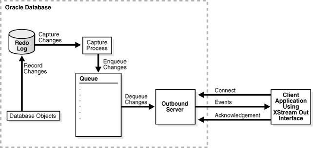

# Provision and Configure Oracle Database with XStream Out Interface

For this workflow, we will use **[Oracle Database 23ai Free Lite Edition Container Image](https://container-registry.oracle.com/ords/ocr/ba/database/free)** to provision the Oracle Database and configure XStream Out Interface as post database startup task.

## Oracle XStream Out

Oracle XStream Out enables the capture of database changes as Logical Change Records (LCRs) from the redo log and streams  these changes to a Confluent XStream CDC Source Connector via an outbound server. An LCR encapsulates information about a database change, such as an INSERT, UPDATE, DELETE, or a DDL operation. Check out the **[Oracle XStream](https://docs.oracle.com/en/database/oracle/oracle-database/23/xstrm/introduction-to-xstream.html)** documentation for more details.

<p align="center" width="75%">
    
</p>


## Oracle Database Configuration Overview

The `./oracle` directory contains manifest files to provision and configure an Oracle Database instance with XStream CDC support in **`oracle`** namespace. 

Below is a high-level summary of the key variables and configuration details for the Oracle Database:

### 1. Environment Variables (from [`configmap-config.yaml`](./configmap-config.yaml))

- **ORACLE_SID**: Container Database name (default: `FREE`)
- **ORACLE_PDB**: Pluggable Database name (default: `ORCLPDB1`)
- **ORACLE_PWD**: Database password
- **XSTREAM_ADMIN_USER** / **XSTREAM_CONNECT_USER**: XStream admin and connect users
- **XSTREAM_OUTBOUND_SERVER**: XStream outbound server name

> **Note:**  
> Additional configuration properties (tablespace names, schema, character set, etc.) are defined in [`configmap-config.yaml`](./configmap-config.yaml). Refer to that file for the full list of environment variables and their default/set values.

---

### 2. Database Post-Startup ConfigMap Scripts

These scripts are executed automatically after the Oracle Database container starts to complete configuration and validation tasks:

- **xstream-setup.sh** ([`configmap-xstream.yaml`](./configmap-xstream.yaml)):  
  Runs Oracle XStream CDC configuration setup, memory management, and user creation using the above environment variables.

- **sample-data-setup.sh** ([`configmap-sample-data.yaml`](./configmap-sample-data.yaml)):
  Creates a sample schema and tables in the pluggable database for CDC demonstration.

- **orclcdc_readiness.sh** ([`configmap-readiness.yaml`](./configmap-readiness.yaml)):
  Validates the readiness of the Oracle Database for XStream CDC operations.

---

### 3. StatefulSet and Persistent Storage

- The Oracle Database is deployed as a Kubernetes StatefulSet (see [`statefulset.yaml`](./statefulset.yaml)), mounting persistent storage for data durability via a PersistentVolumeClaim (see [`pvc.yaml`](./pvc.yaml)).

- All configuration and setup scripts are mounted as volumes from their respective ConfigMaps and executed automatically after database startup, as defined in the StatefulSet manifest.

---

## Deploy Oracle Database with XStream

### Set the environment variables if not already set

```sh
{
  export ORACLE_HOME=$(pwd)/oracle
  export ORACLE_NS='oracle'
  echo "ORACLE_HOME=${ORACLE_HOME} \nORACLE_NS=${ORACLE_NS}"
  ls -l ${ORACLE_HOME}
}
```

### Create the namespace

```sh
{
  kubectl apply -f ${ORACLE_HOME}/namespace.yaml
  kubectl get namespace -l app=oracle
}
```

### Create the configmaps

```sh
{
  kubectl apply -f ${ORACLE_HOME}/configmap-config.yaml \
                -f ${ORACLE_HOME}/configmap-xstream.yaml \
                -f ${ORACLE_HOME}/configmap-sample-data.yaml \
                -f ${ORACLE_HOME}/configmap-readiness.yaml \
                -n ${ORACLE_NS}
  kubectl get configmap -n ${ORACLE_NS} -l app=oracle
}
```

### Deploy the Oracle Database with XStream

```sh
{
  kubectl apply -f ${ORACLE_HOME}/pvc.yaml \
                -f ${ORACLE_HOME}/statefulset.yaml \
                -f ${ORACLE_HOME}/service.yaml \
                -n ${ORACLE_NS}
}
```

### Verify the Oracle Database is ready

Run the following command to check the status of the Oracle Database, wait for atleast 5 - 10 minutes for the Oracle Database to be ready.

```sh
{
  kubectl get pod -n ${ORACLE_NS} -l app=oracle
  echo "Waiting for the 5 minutes for the Oracle Database to be ready..."
  kubectl wait --for=condition=ready pod -l app=oracle -n ${ORACLE_NS} --timeout=300s
  kubectl get pod -n ${ORACLE_NS} -l app=oracle
}
```

In a new terminal, run the following command to check the logs of the Oracle Database pod and verify the database is ready and no errors are reported.

```sh
{
  export ORACLE_NS='oracle'
  kubectl logs -f -l app=oracle -n ${ORACLE_NS}
}
```

Post Database Startup scripts logs are available in `/home/oracle/` directory of the Oracle Database pod.

```sh
{
  kubectl exec -it oracle-db-0 -n ${ORACLE_NS} -c oracle-db -- /bin/bash -c "ls -l /home/oracle/ && cat /home/oracle/orclcdc_readiness.log"
}
```

Ignore `FAILED: Database user 'C##CFLTADMIN' does not have the required XStream administrator privileges.` error in the readiness check logs. This is expected as `DBMS_XSTREAM_AUTH.GRANT_ADMIN_PRIVILEGE` is disabled in 23ai, we have to use `GRANT XSTREAM_CAPTURE` statement instead.

> `ℹ️ After the Oracle Database pod starts, XStream configuration, sample data setup, and readiness checks are automatically performed via ConfigMap scripts. No manual steps are required for these post-startup tasks.`

**✅ The Oracle Database pod is now ready. Please proceed and continue with the remaining configuration steps.**

[Provision Confluent Platform using CFK Operator](../README.md#deploy-confluent-platform-using-cfk-operator)

--- 