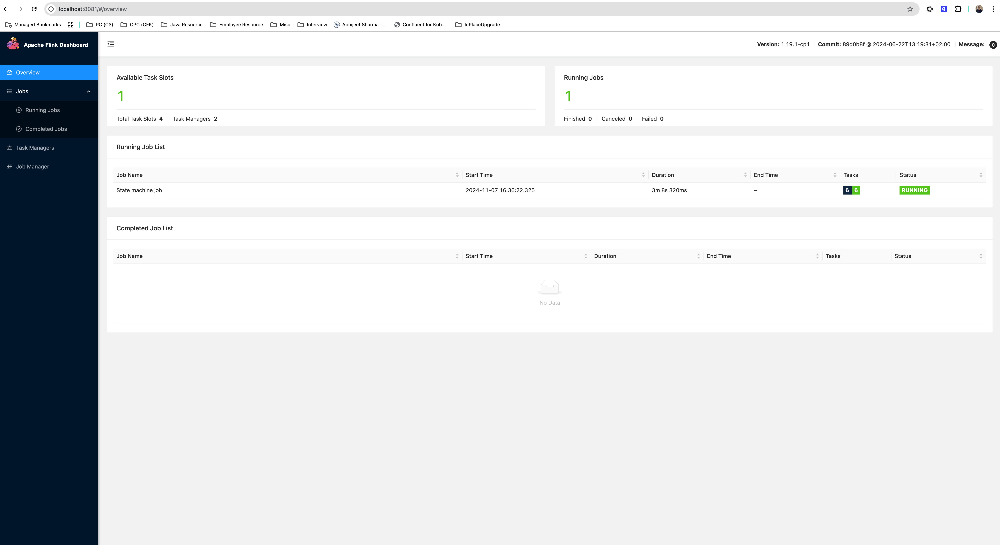

## Setup Certs

This playbook we will walk through example workflow of CFK Day2 Ops for the Confluent Manager for Apache Flink [mTLS].

## Prerequisites

* Certificates with appropriate Subject Alternate Names (SANs) are required for the Confluent Manager for Apache Flink [mTLS] setup. These are available under 

1.  certs/ [Certs in PEM]
2.  jks/ [Keystore & Truststore]

* CFK version should be higher >= 2.10 and CMF v1.0.0

## Install Confluent Platform for Apache Flink Kubernetes operator (FKO)
Lets install Confluent Platform for Apache Flink Kubernetes operator (FKO)

```bash
helm repo add confluentinc https://packages.confluent.io/helm
helm repo update
kubectl create -f https://github.com/jetstack/cert-manager/releases/download/v1.8.2/cert-manager.yaml
helm upgrade --install cp-flink-kubernetes-operator confluentinc/flink-kubernetes-operator
```

## Deploy CMF

1. Create ns
    ```bash
    kubectl create ns operator
    ```
2. Create certs under configMap
    ```bash
    kubectl create configmap cmf-keystore -n operator --from-file ./jks/keystore.jks
    kubectl create configmap cmf-truststore -n operator --from-file ./jks/truststore.jks
    ```
3. local.yaml for CMF with mTLS
    ```
   cmf:
      ssl:
        keystore: /opt/keystore/keystore.jks
        keystore-password: allpassword
        trust-store: /opt/truststore/truststore.jks
        trust-store-password: allpassword
        client-auth: need
      authentication:
        type: mtls
      k8s: #This configuration is only required if you did not setup FKO and CMF can reach FKO
        enabled: true
   mountedVolumes:
      volumeMounts:
        - name: truststore
          mountPath: /opt/truststore
        - name: keystore
          mountPath: /opt/keystore
      volumes:
        - name: truststore
          configMap:
            name: cmf-truststore
        - name: keystore
          configMap:
            name: cmf-keystore
    ```   
4. Deploy via HELM
    ```bash
   kubectl create secret generic <license-secret-name> --from-file=license.txt
   helm upgrade --install -f local.yaml cmf  confluent-manager-for-apache-flink --set license.secretRef=<license-secret-name> --namespace operator
    ```
5. Add apt local names in /etc/hosts and port forward
    ```
    127.0.0.1       confluent-manager-for-apache-flink.operator.svc.cluster.local
    ```
   
   ```
   while true; do kubectl port-forward service/cmf-service 8080:80 -n operator; done;
   ```
6. Perform CURL
    ```bash
    curl --cert ./certs/server.pem --key ./certs/server-key.pem --cacert certs/cacerts.pem  https://confluent-manager-for-apache-flink.operator.svc.cluster.local:80/cmf/api/v1/environments
    ```   
   
### Deploy CFK
One has to deploy CFK with `enableCMFDay2Ops=true`, this will enable CFK to reconcile on CMFRestClass, FlinkEnvironment & FlinkApplication CRs.
```
helm upgrade --install confluent-operator \
        confluentinc/confluent-for-kubernetes \
        --set enableCMFDay2Ops=true
```

Note: Make sure to install CMFRestClass, FlinkEnvironment & FlinkApplication CRs to enable this on an existing confluent-operator

### Deploy CMF Rest Class
1. Create `cmf-day2-tls` configMap
   ```bash
    kubectl create secret generic cmf-day2-tls -n operator --from-file=fullchain.pem=./certs/server.pem --from-file=privkey.pem=./certs/server-key.pem --from-file=cacerts.pem=./certs/cacerts.pem
   ```
2. Deploy CMFRestClass
    ```bash
        kubectl apply -f cmfrestclass.yaml
    ```
3. Verify status has been populated
    ```bash
       kubectl get cmfrestclass default  -n operator -oyaml
    ```

### Deploy Flink Environment
1. Deploy FlinkEnvironment
    ```bash
        kubectl apply -f flinkenvironment.yaml
    ```
2. Verify status has been populated and cfkInternalState has been moved to `Created`
    ```bash
       kubectl get flinkenvironment default  -n operator -oyaml
    ```
3. Sample status
    ```bash
      cfkInternalState: CREATED
      cmfSync:
        errorMessage: ""
        lastSyncTime: "2024-10-23T16:20:15+05:30"
        status: Created
      observedGeneration: 1
    ```    

### Deploy Flink Application
1. Deploy FlinkApplication
    ```bash
        kubectl apply -f flinkapplication.yaml
    ```
2. Verify status has been populated and cfkInternalState has been moved to `Created`
    ```bash
       kubectl get flinkapplication default  -n operator -oyaml
    ```
3. Sample status
    ```
    status:
      cfkInternalState: CREATED
      clusterInfo:
        flink-revision: 89d0b8f @ 2024-06-22T13:19:31+02:00
        flink-version: 1.19.1-cp1
        total-cpu: "3.0"
        total-memory: "3296722944"
      cmfSync:
        errorMessage: ""
        lastSyncTime: "2024-11-07T10:02:57Z"
        status: Created
      jobManagerDeploymentStatus: DEPLOYING
      jobStatus:
        checkpointInfo:
          lastPeriodicCheckpointTimestamp: 0
        jobId: 91267bde25b37a881489d1e390d5a96b
        jobName: State machine job
        savepointInfo:
          lastPeriodicSavepointTimestamp: 0
          savepointHistory: []
        startTime: "1730970323318"
        state: RECONCILING
        updateTime: "1730970362059"
      lifecycleState: DEPLOYED
      reconciliationStatus:
        lastReconciledSpec: '{"spec":{"job":{"jarURI":"local:///opt/flink/examples/streaming/StateMachineExample.jar","parallelism":3,"entryClass":null,"args":[],"state":"running","savepointTriggerNonce":null,"initialSavepointPath":null,"checkpointTriggerNonce":null,"upgradeMode":"stateless","allowNonRestoredState":null,"savepointRedeployNonce":null},"restartNonce":null,"flinkConfiguration":{"metrics.reporter.prom.factory.class":"org.apache.flink.metrics.prometheus.PrometheusReporterFactory","metrics.reporter.prom.port":"9249-9250","rest.profiling.enabled":"true","taskmanager.numberOfTaskSlots":"2"},"image":"confluentinc/cp-flink:1.19.1-cp1","imagePullPolicy":null,"serviceAccount":"flink","flinkVersion":"v1_19","ingress":null,"podTemplate":null,"jobManager":{"resource":{"cpu":2.0,"memory":"1048m","ephemeralStorage":null},"replicas":1,"podTemplate":{"metadata":{"labels":{"platform.confluent.io/origin":"flink"}}}},"taskManager":{"resource":{"cpu":1.0,"memory":"1048m","ephemeralStorage":null},"replicas":null,"podTemplate":{"metadata":{"labels":{"platform.confluent.io/origin":"flink"}}}},"logConfiguration":null,"mode":null},"resource_metadata":{"apiVersion":"flink.apache.org/v1beta1","metadata":{"generation":6},"firstDeployment":false}}'
        lastStableSpec: '{"spec":{"job":{"jarURI":"local:///opt/flink/examples/streaming/StateMachineExample.jar","parallelism":3,"entryClass":null,"args":[],"state":"running","savepointTriggerNonce":null,"initialSavepointPath":null,"checkpointTriggerNonce":null,"upgradeMode":"stateless","allowNonRestoredState":null,"savepointRedeployNonce":null},"restartNonce":null,"flinkConfiguration":{"metrics.reporter.prom.factory.class":"org.apache.flink.metrics.prometheus.PrometheusReporterFactory","metrics.reporter.prom.port":"9249-9250","rest.profiling.enabled":"true","taskmanager.numberOfTaskSlots":"2"},"image":"confluentinc/cp-flink:1.19.1-cp1","imagePullPolicy":null,"serviceAccount":"flink","flinkVersion":"v1_19","ingress":null,"podTemplate":null,"jobManager":{"resource":{"cpu":1.0,"memory":"1048m","ephemeralStorage":null},"replicas":1,"podTemplate":{"metadata":{"labels":{"platform.confluent.io/origin":"flink"}}}},"taskManager":{"resource":{"cpu":1.0,"memory":"1048m","ephemeralStorage":null},"replicas":null,"podTemplate":{"metadata":{"labels":{"platform.confluent.io/origin":"flink"}}}},"logConfiguration":null,"mode":null},"resource_metadata":{"apiVersion":"flink.apache.org/v1beta1","metadata":{"generation":2},"firstDeployment":true}}'
        reconciliationTimestamp: 1730970552044
        state: DEPLOYED
      taskManager:
        labelSelector: component=taskmanager,app=flink-app1
        replicas: 2
    ```

### Validate
One can verify the deployed Flink job via flink UI using following steps:

1. After creation of FlinkApplication one can validate pods have come up inside the `default` namespace
```
❯ kubectl get pods -n default
NAME                                        READY   STATUS    RESTARTS   AGE
flink-app1-f48768587-wbsmx               1/1     Running   0          65s
flink-app1-taskmanager-1-1               1/1     Running   0          30s
flink-app1-taskmanager-1-2               1/1     Running   0          30s
flink-kubernetes-operator-d8546dfff-8zdkt   2/2     Running   0          11d
```

2. Port forward Fink Job Manager
```
// via confluent CLI
# see https://docs.confluent.io/confluent-cli/current/command-reference/flink/application/confluent_flink_application_web-ui-forward.html 
confluent flink application web-ui-forward 
// via kubectl
kubectl port-forward service/flink-app1-rest 8081:8081 -n default
```

3. Visit https://localhost:8081/
