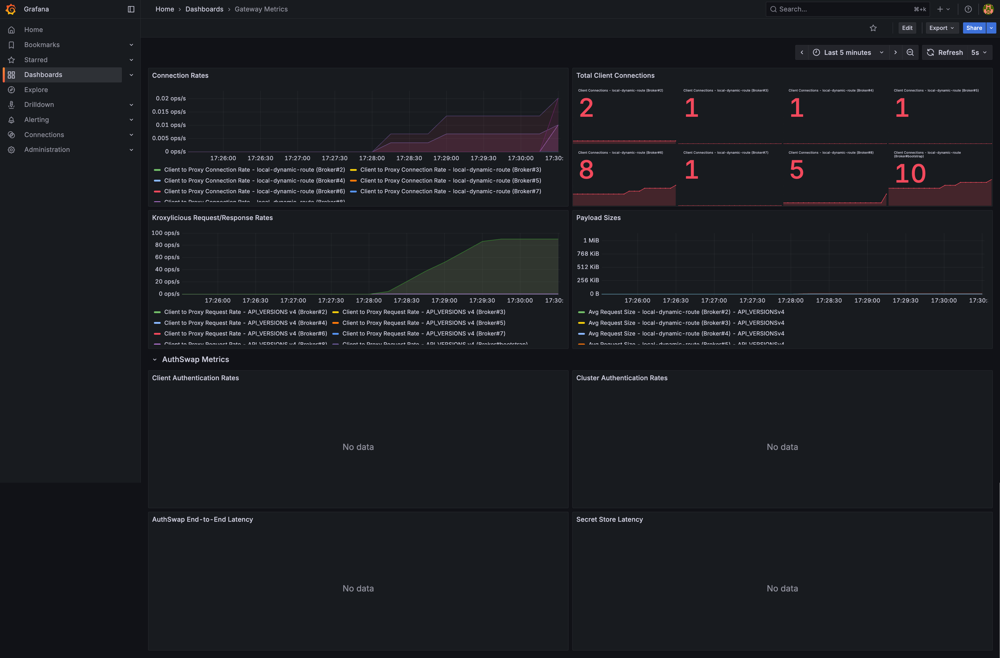
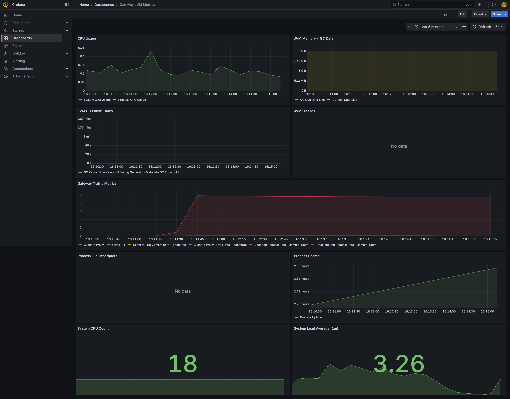

# Gateway Metrics Monitoring

Prometheus + Grafana stack for CC Gateway, with three pre-built dashboards.

## Prerequisites

- Docker and Docker Compose
- Gateway running with the metrics admin endpoint enabled on `localhost:9190/metrics`

## Quick start

```bash
cd gateway/monitoring
docker-compose up -d
```

- Grafana: http://localhost:3000 (`admin` / `admin`)
- Prometheus: http://localhost:9090

Dashboards (auto-provisioned):

| Dashboard | Covers |
|---|---|
| `gateway-dashboard.json` | Connections, request/response rates, payload sizes, AuthSwap auth rate & latency |
| `jvm-dashboard.json` | CPU, JVM memory/GC, threads, process uptime, file descriptors |

[](./assets/gateway-dashboard.png)
[](./assets/gateway-advanced-dashboard.png)
[](./assets/jvm-dashboard.png)

See [RECOMMENDED-METRICS.md](RECOMMENDED-METRICS.md) for the metrics worth alerting on.

## Gateway config used by this stack

```yaml
admin:
  bindAddress: "0.0.0.0"
  port: 9190
  endpoints:
    metrics: true
  jvmMetrics:
    - "JvmGcMetrics"
    - "JvmMemoryMetrics"
    - "JvmThreadMetrics"
    - "ProcessorMetrics"
    - "UptimeMetrics"
    - "FileDescriptorMetrics"   # needed for the Process File Descriptors panel
  commonTags:
    service: "gateway"
    environment: "development"
```

`FileDescriptorMetrics` is not in Gateway's default `jvmMetrics` list — add it explicitly to get the file-descriptor panel.
AuthSwap panels only populate once a route is configured with AuthSwap auth (`security.auth` of type `clientAuth`/`clusterAuth` or legacy `swap`) — passthrough-auth routes never emit `gateway_authswap_*`.

Prometheus scrapes `host.docker.internal:9190/metrics` every 5s (`prometheus/prometheus.yml`).

## Stopping

```bash
docker-compose down       # keep data
docker-compose down -v    # also remove volumes
```
