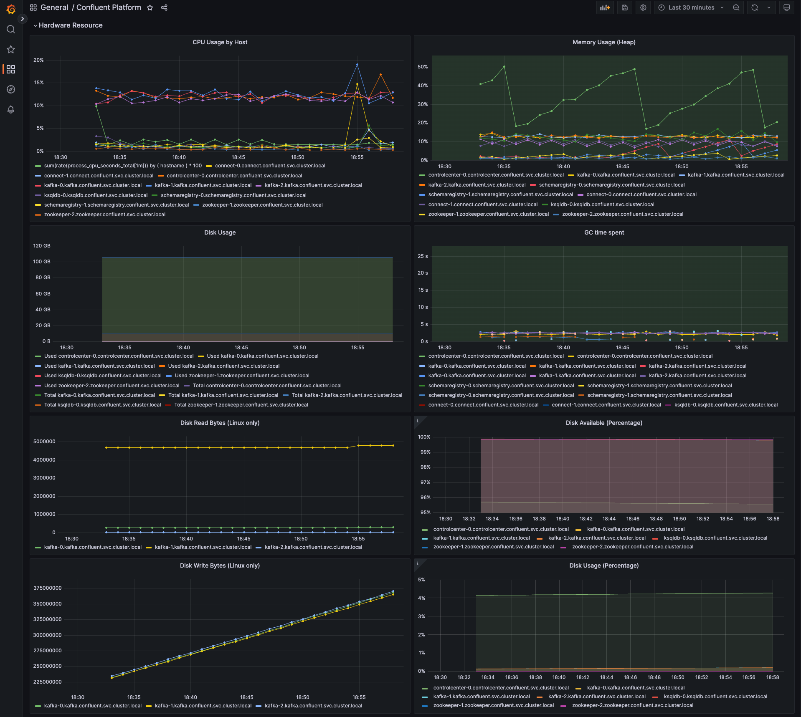
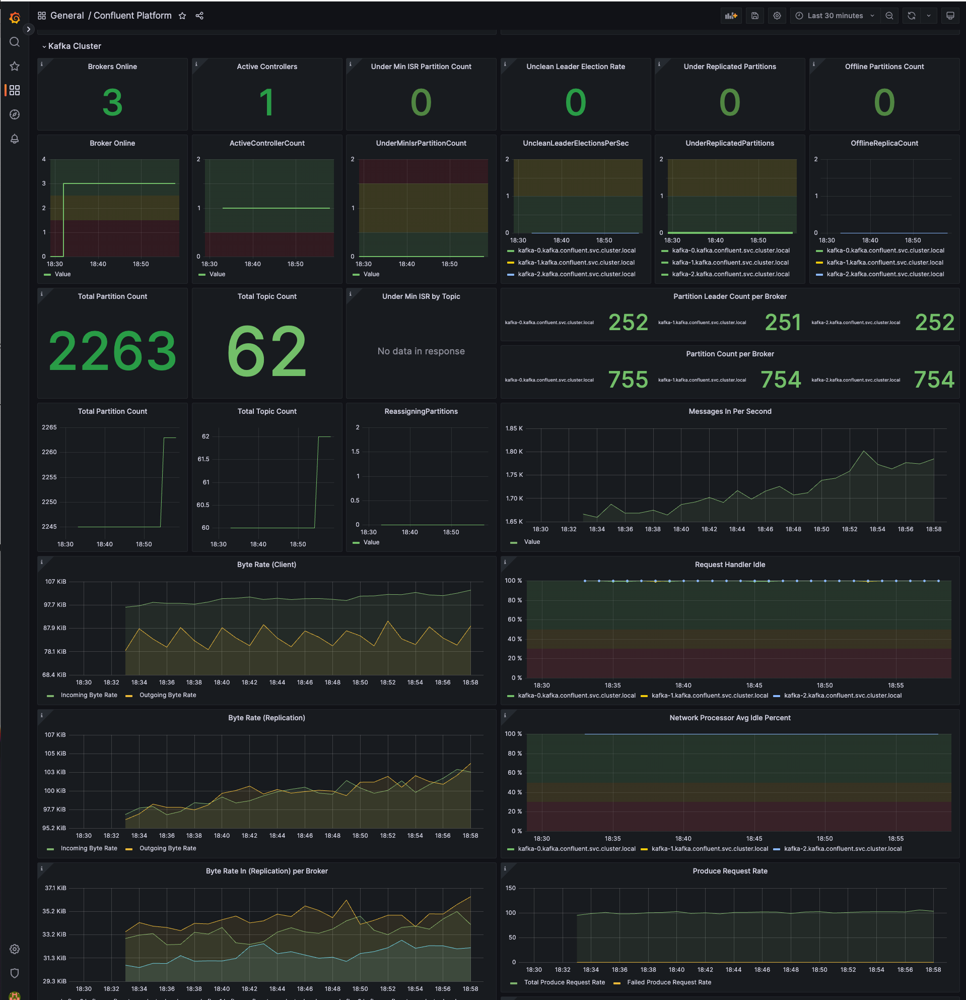
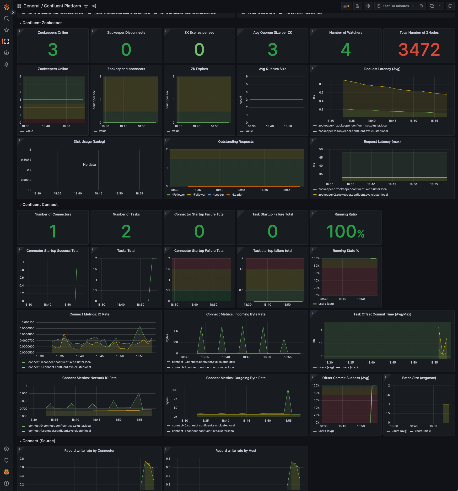
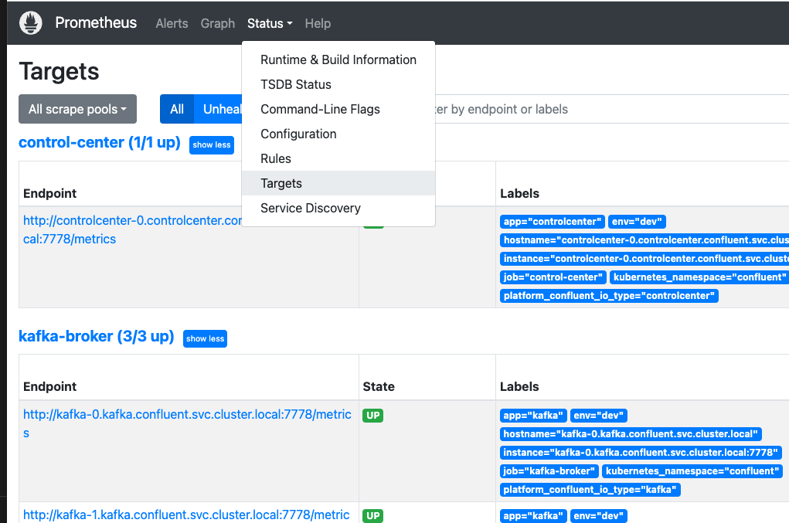
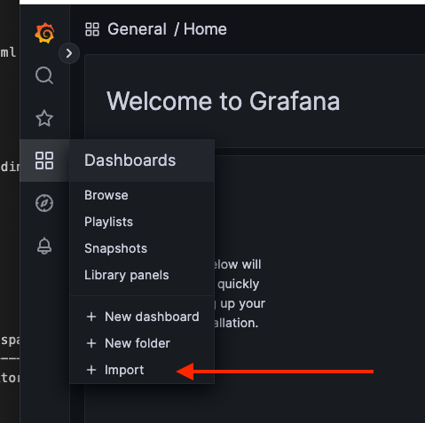
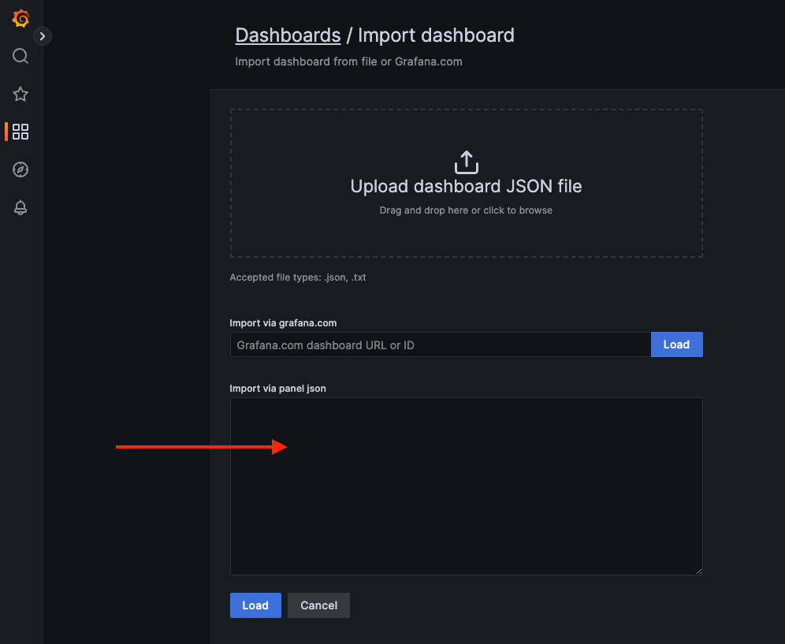

# JMX Monitoring using Prometheus and Grafana











# Steps

## 1. Run Confluent Platform

```sh
helm repo add confluentinc https://packages.confluent.io/helm
kubectl create namespace confluent
kubectl apply -f confluent-platform.yml -n confluent
```

Verify confluent components are created as pods
```sh
kubectl get pods -n confluent
```

Once a Kafka broker and a Connect worker is ready, run the below command to add topics and connectors.

```sh
kubectl apply -f connect-task-datagen.yml -n confluent
```


## 2. Deploy Prometheus

Create monitoring namespace

```sh
kubectl create namespace monitoring
```

Create a cluster role so that components in `monitoring` can access `confluent` namespace. This is required to access JMX metrics endpoint.

```sh
kubectl apply -f prometheus-rbac.yml
```

(Optional) to persist data, change the reference from `prometheus-tmp-storage-volume` to `prometheus-persistent-storage` in `prometheus-deployment.yml` and update the PVC claim name reference within `prometheus-persistent-storage`. Or run the command below to persist locally.
```sh
kubectl apply -f prometheus-volume.yml -n monitoring
```

Load Promtheus rules which tells how to get metrics. You can also add alerts in this file.
```sh
kubectl apply -f prometheus-config-map.yml -n monitoring
```

Deploy prometheus
```sh
kubectl apply -f prometheus-deployment.yml -n monitoring
```

Deploy prometheus service to expose its port

```sh
kubectl apply -f prometheus-service.yml -n monitoring
```

Make sure prometheus is working by running
```sh
kubectl get pod -n monitoring
kubectl port-forward pod/prometheus-deployment-5cdf44b7d4-fskzw   -n monitoring 9090:9090
```
Then open localhost:9090 on the browser and access `Status` -> `Targets`. Make sure all components are `UP`.



## 3. Deploy Grafana

Now that Prometheus is pulling metrics from Kafka components, we setup Grafana to visualize this.


(Optional) to persist data, change the reference from `grafana-tmp-storage-volume` to `grafana-persistent-storage` in `grafana-deployment.yml` and update the PVC claim name reference within `grafana-persistent-storage`. Or run the command below to persist locally.

```sh
kubectl apply -f grafana-volume.yml -n monitoring
```


Load Grafana datasource which tells where to get metrics. You can also configure this manually afterwards.
```sh
kubectl apply -f grafana-datasource-config.yml -n monitoring
```

Deploy Grafana
```sh
kubectl apply -f grafana-deployment.yml -n monitoring
```

Deploy Grafana service to expose its port

```sh
kubectl apply -f grafana-service.yml -n monitoring
```

Make sure Grafana is working by running
```sh
kubectl get pod -n monitoring
kubectl port-forward pod/grafana-68dd7f6bb5-89jfq  -n monitoring 3000:3000
```
Then open localhost:3000 on the browser and login with `user=admin`, `password=admin`. Then click "Skip" to get to the dashboard.

Click `+ Import` 



and paste the contents of `grafana-dashboard.json` into the textarea below and click `Load`.



